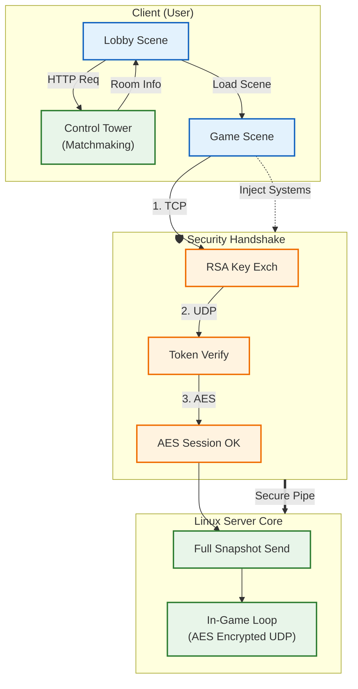
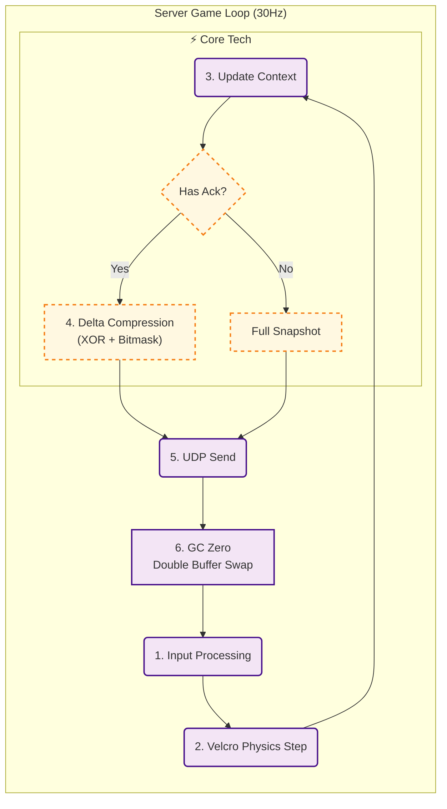

# **DashBumper: Linux Dedicated Server Architecture**

**Linux Dedicated Server 기반의 실시간 멀티플레이 서바이벌 게임** 
상용 엔진의 네트워크 한계를 극복하기 위해
직접 구현한 델타 압축(Delta Compression)과
**GC-Zero 메모리 구조**를 적용하여, 대규모 트래픽 상황에서도 안정적인 동기화를 보장합니다.

## **📖 Project Overview**

* **Project Name:** DashBumper  
* **Role:** 1인 개발 (Server Architecture, Network Logic, Client Prediction)  
* **Dev Period:** 2025.09.04 ~ 2025.12.04  
* **Video Demo:** https://youtu.be/V8DBk1QB_2Q

### **🎯 Core Objectives**

* **Deterministic Environment:** Unity Physics의 비결정론적 특성을 배제하고, 서버 권한(Server Authority) 기반의 완벽한 동기화 구현.  
* **Optimization:** 30Hz 틱레이트 환경에서 GC Allocation 0Bytes 달성 및 대역폭 최적화.  
* **Secure Networking:** 신뢰성 있는 TCP 핸드셰이크와 빠른 UDP 통신의 하이브리드 구조 및 보안 적용.

## **🛠️ Tech Stack**

| Category | Technology |
| :---- | :---- |
| **Engine** | Unity 6000.0.62f1 |
| **Language** | C# (Server/Client Shared Logic) |
| **Server OS** | Linux (Ubuntu 20.04) on Google Cloud Platform (GCP) |
| **Architecture** | DOD (Data Oriented Design), ECS Pattern, VContainer (DI) |
| **Network** | TCP/UDP Custom Protocol, MessagePipe, UniRx |
| **Security** | AES Encryption, HMAC Authentication |

## **📂 System Architecture Overview**

### **TCP/UDP/HTTP가 유기적으로 연동되는 하이브리드 접속 구조**

### **GC Zero를 위한 더블 버퍼링 및 결정론적 물리 루프**

## **🚀 Key Features & Solutions**

### **1. Zero Allocation & GC Optimization**

**File:** NetworkDataConverter.cs, GameManager.cs

* **Problem:** 초당 30회 발생하는 패킷 직렬화(Serialization) 과정에서 BinaryWriter의 내부 문자열 처리 등으로 인해 지속적인 GC Spike가 발생, 서버 프레임 드랍 유발.  
* **Solution:**  
  * RecyclableMemoryStream (Microsoft)과 ArrayPool<byte>를 도입하여 힙 메모리 할당을 원천 차단.  
  * 제네릭 (TryDeserializeInto<T> where T : struct)을 활용하여 Boxing/Unboxing 제거.  
* **Result:** **In-Game Loop 분당 GC Allocation 0 Bytes 달성.**

### **2. Custom Delta Compression**

**File:** DeltaCompressionManager.cs

* **Problem:** 매 틱(Tick)마다 전체 상태(Full Snapshot)를 전송할 경우 대역폭 낭비가 심각하여 동시 접속자 수 확장에 한계.  
* **Solution:**  
  * **Double Buffering:** 현재 프레임(Write)과 이전 프레임(Read) 버퍼를 XOR 비트 연산하여 변경된 필드만 추출.  
  * 변경된 데이터에만 비트 플래그(Bitmask)를 세워 전송하는 로직 구현.  
* **Result:** **패킷 사이즈 평균 40~60% 절감.**

### **3. Server Authority Physics (Deterministic)**

**File:** ServerPhysicsManager.cs

* **Architecture:** Unity Physics(PhysX)는 비결정론적(Non-deterministic)이므로 서버-클라이언트 간 미세한 위치 오차가 누적되는 문제 발생.  
* **Solution:**  
  * 순수 C# 기반의 결정론적 물리 엔진인 **VelcroPhysics**를 래핑하여 사용.  
  * RootInstaller.cs를 통해 물리 시스템을 DI 컨테이너에 등록하고, 게임 로직과 물리 연산을 분리.  
* **Benefit:** 모든 클라이언트와 서버에서 동일한 입력에 대해 **완벽하게 동일한 물리 결과 보장.**

### **4. Robust Security Architecture**

**File:** SecurityManager.cs

* **Protocol:** TCP(신뢰성) → AES Key 교환 → UDP(HMAC 서명) 순서의 3단계 핸드셰이크 구현.  
* **Features:**  
  * **RSA/AES Hybrid:** RSA로 세션키를 안전하게 교환하고, 성능을 위해 AES로 실시간 패킷 암호화.  
  * **HMAC Authentication:** 비연결성 UDP 패킷의 변조(Man-in-the-Middle) 방지 서명 포함.

## **📝 Troubleshooting Log**

### **Issue 1: GC Spike during Packet Serialization**

* **Situation:** 프로파일링 결과 BinaryWriter.Write(string) 호출 시마다 내부적으로 임시 버퍼를 생성하여 주기적인 GC Spike가 발생함을 확인.  
* **Analysis:** C# 기본 라이브러리의 인코딩 방식이 고성능 리얼타임 서버에는 적합하지 않은 메모리 패턴을 보임.  
* **Action:** NetworkDataConverter.cs에 ArrayPool을 사용하는 커스텀 직렬화 메서드를 직접 구현하고, 전송되는 모든 패킷 구조체를 class가 아닌 struct로 변경하여 참조 비용 제거.  
* **Result:** 패킷 처리 과정의 GC Alloc **0KB** 달성 및 프레임 안정화.

### **Issue 2: Race Condition in Security Handshake**

* **Situation:** 클라이언트의 UDP 패킷이 서버의 AES 키 생성 및 등록 로직보다 먼저 도착하여, 암호화 해제 실패(Decryption Failed) 오류가 간헐적으로 발생.  
* **Action:** SecurityManager.cs에 _armedPlayers 상태와 PendingQueue를 도입. 보안 채널이 완전히 확립되기 전 도착한 패킷은 폐기하지 않고 큐에 보관했다가, 핸드셰이크 완료 즉시 순차적으로 처리하도록 변경.  
* **Result:** 네트워크 지연(Latency)이 있는 환경에서도 핸드셰이크 성공률 **100%** 보장.

## **📜 Source Code Highlights**

*본 프로젝트는 Private Repository로 관리 중입니다. 핵심 로직의 구조는 아래 설명을 참고해 주세요.*

* **RootInstaller.cs**: VContainer 기반의 의존성 주입(DI) 및 시스템 생명주기 관리.  
* **GameManager.cs**: 결정론적 서버 루프(Tick) 및 전체 게임 흐름 제어.  
* **ServerPhysicsManager.cs**: Unity 의존성을 제거한 결정론적 물리 엔진 래퍼.  
* **DeltaCompressionManager.cs**: 비트 연산 기반의 스냅샷 델타 압축 로직.  
* **SecurityManager.cs**: RSA/AES 암호화 및 핸드셰이크 상태 머신.
* **NetworkDataConverter.cs**: GC 최적화 기반 제네릭 공용 메서드 (직렬화/역직렬화 유틸리티).
