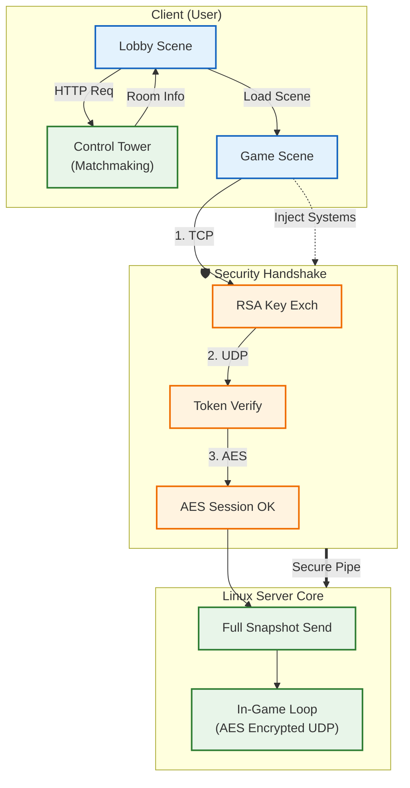
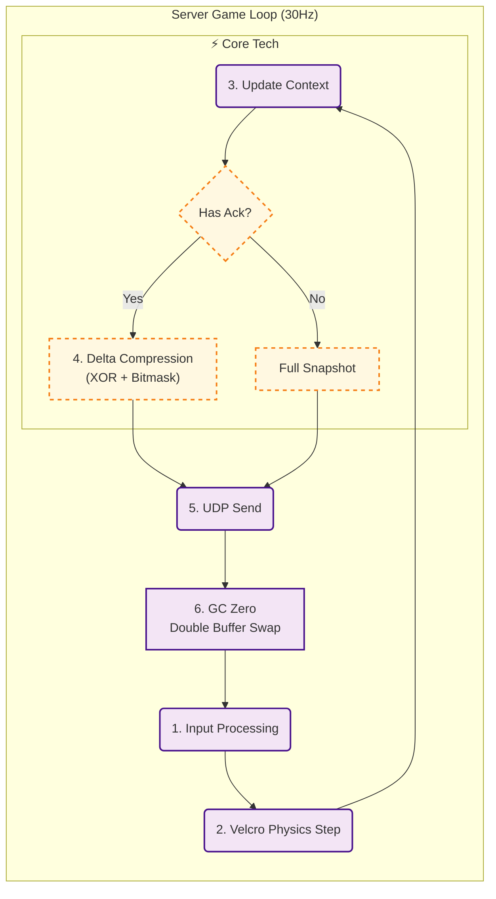

# Project: DashBumper
### Linux Dedicated Server Architecture & Network Optimization

---

## 1. Project Overview
* **Role:** 1인 개발 (Server Architecture, Network Logic, Client Prediction)
* **Period:** 2025.09.04 ~ 2025.12.04
* **Demo Video:** [YouTube Link](https://youtu.be/V8DBk1QB_2Q) (GC Profiling 포함)

 

## 2. Core Objectives
* **Deterministic:** Unity Physics를 배제하고, **서버 권한(Server Authority)** 기반의 결정론적 동기화 구현.
* **Optimization:** 30Hz 틱레이트 환경에서 **GC Alloc 0 Bytes** 달성 및 대역폭 최적화.
* **Security:** TCP(인증)와 UDP(인게임)를 결합한 **하이브리드 핸드셰이크** 구조.

 

## 3. Tech Stack
* **Server:** C#, .NET Standard, Ubuntu 20.04 (GCP)
* **Network:** TCP/UDP Custom Protocol, MessagePipe, UniRx
* **Core Lib:** `VelcroPhysics` (Deterministic), `RecyclableMemoryStream`, `VContainer` (DI)

### **TCP/UDP/HTTP가 유기적으로 연동되는 하이브리드 접속 구조**

### **GC Zero를 위한 더블 버퍼링 및 결정론적 물리 루프**

## 4. System Architecture Overview

### ① TCP/UDP/HTTP 하이브리드 접속 구조
> **[여기에 첫 번째 다이어그램(Macro) 이미지를 넣어주세요]**
> *관제탑 매칭부터 보안 핸드셰이크, 인게임 진입까지의 연결 흐름도*

### ② GC Zero 및 결정론적 물리 루프
> **[여기에 두 번째 다이어그램(Micro) 이미지를 넣어주세요]**
> *더블 버퍼링과 델타 압축이 적용된 서버 코어 틱(Tick) 아키텍처*

---

## 5. Key Technical Decisions

### A. Zero Allocation & GC Optimization
* **문제:** 초당 30회 발생하는 패킷 직렬화 과정에서 `BinaryWriter`의 내부 문자열 처리로 인해 GC Spike 발생.
* **해결:**
    1. `RecyclableMemoryStream`(Microsoft)과 `ArrayPool<byte>`를 도입하여 힙 할당 방지.
    2. 제네릭 제약조건(`where T : struct`)을 사용하여 **Boxing/Unboxing 원천 차단**.
* **결과:** 인게임 루프 내 분당 **GC Allocation 0 Bytes** 달성.

### B. Custom Delta Compression
* **문제:** 매 틱(Tick)마다 전체 스냅샷 전송 시 대역폭 낭비가 심해 동시 접속자 확장이 어려움.
* **해결:**
    1. **더블 버퍼링(Read/Write)** 구조 도입.
    2. 이전 프레임과 현재 프레임을 **XOR 비트 연산**하여 변경된 필드만 추출.
    3. 변경된 데이터에만 비트 플래그(Bitmask)를 세워 전송하는 로직 직접 구현.
* **결과:** 패킷 사이즈 평균 **40~60% 절감**.

### C. Deterministic Physics (Server Authority)
* **접근:** Unity Physics(PhysX)는 비결정론적이므로 서버 동기화에 부적합하다고 판단.
* **해결:** 순수 C# 기반 물리 엔진인 `VelcroPhysics`를 래핑하여 사용. `RootInstaller`를 통해 물리 시스템을 DI로 주입하여 게임 로직과 물리 연산을 분리.
* **이점:** 모든 클라이언트와 서버에서 동일 입력에 대해 **완벽하게 동일한 결과 보장**.

### D. Hybrid Security System
* **구조:** TCP(키 교환) → UDP(HMAC 서명)로 이어지는 **3-Way Handshake** 설계.
* **구현:**
    * **RSA:** 초기 세션키 교환에만 사용 (보안성).
    * **AES:** 실시간 패킷 암호화에 사용 (성능).
    * **HMAC:** UDP 패킷의 변조 방지 서명 포함.

---

## 6. Troubleshooting Log

### [Issue 1] Packet Serialization GC Spike
> **현상:** 프로파일링 결과 `BinaryWriter.Write(string)` 호출 시 내부 임시 버퍼 생성으로 GC 발생 확인.  
> **조치:** `NetworkDataConverter.cs`에 `ArrayPool`을 사용하는 커스텀 직렬화 메서드 구현. 모든 패킷 구조체를 `class`가 아닌 `struct`로 변경.  
> **결과:** 패킷 처리 과정 **GC Alloc 0KB**로 최적화.

### [Issue 2] Security Handshake Race Condition
> **현상:** 클라이언트의 UDP 패킷이 서버의 암호화 키 등록보다 먼저 도착하여 복호화 실패 오류 발생.  
> **조치:** `SecurityManager`에 대기 큐(PendingQueue) 도입. 핸드셰이크 완료 전 도착한 패킷은 큐에 보관했다가, 보안 채널 확립 즉시 순차 처리하도록 변경.  
> **결과:** 네트워크 지연 환경에서도 **핸드셰이크 성공률 100% 보장**.
