# Project: DashBumper
### Linux Dedicated Server Architecture & Network Optimization

---

## 1. Project Overview
* **Role:** 1인 개발 (Server Architecture, Network Logic, Client Prediction)
* **Period:** 2025.09.04 ~ 2025.12.04
* **Demo Video:** [YouTube Link](https://youtu.be/V8DBk1QB_2Q) (GC Profiling 포함)

 

## 2. Core Objectives
* **Deterministic:** Unity Physics를 배제하고, **서버 권한(Server Authority)** 기반의 결정론적 동기화 구현.
* **Optimization:** 30Hz 틱레이트 환경에서 **GC Alloc 0 Bytes** 달성 및 대역폭 최적화.
* **Security:** TCP(인증)와 UDP(인게임)를 결합한 **하이브리드 핸드셰이크** 구조.

 

## 3. Tech Stack
* **Server:** C#, .NET Standard, Ubuntu 20.04 (GCP)
* **Network:** TCP/UDP Custom Protocol, MessagePipe, UniRx
* **Core Lib:** `VelcroPhysics` (Deterministic), `RecyclableMemoryStream`, `VContainer` (DI)

```mermaid
flowchart TD
    %% 스타일 정의
    classDef cycle fill:#f3e5f5,stroke:#4a148c,stroke-width:2px
    classDef opt fill:#fff8e1,stroke:#f57f17,stroke-width:2px,stroke-dasharray: 5 5

    subgraph Server_Tick_Cycle ["Server Game Loop (30Hz)"]
        direction TB
        
        Input("1. Input Processing"):::cycle --> Physics("2. Velcro Physics Step"):::cycle
        Physics --> Context("3. Update Context"):::cycle
        
        subgraph Optimization ["⚡ Core Tech"]
            Context --> Delta{"Has Ack?"}:::opt
            Delta -- "Yes" --> XOR["4. Delta Compression<br/>(XOR + Bitmask)"]:::opt
            Delta -- "No" --> Full["Full Snapshot"]:::opt
        end

        XOR --> Send("5. UDP Send"):::cycle
        Full --> Send
        Send --> GC["6. GC Zero<br/>Double Buffer Swap"]:::cycle
        GC --> Input
    end
```

## 4. System Architecture Overview

### ① TCP/UDP/HTTP 하이브리드 접속 구조

> *관제탑 매칭부터 보안 핸드셰이크, 인게임 진입까지의 연결 흐름도*

### ② GC Zero 및 결정론적 물리 루프

> *더블 버퍼링과 델타 압축이 적용된 서버 코어 틱(Tick) 아키텍처*

---

## 5. Key Technical Decisions

### A. Zero Allocation & GC Optimization
* **문제:** 초당 30회 발생하는 패킷 직렬화 과정에서 `BinaryWriter`의 내부 문자열 처리로 인해 GC Spike 발생.
* **해결:**
    1. `RecyclableMemoryStream`(Microsoft)과 `ArrayPool<byte>`를 도입하여 힙 할당 방지.
    2. 제네릭 제약조건(`where T : struct`)을 사용하여 **Boxing/Unboxing 원천 차단**.
* **결과:** 인게임 루프 내 분당 **GC Allocation 0 Bytes** 달성.

### B. Custom Delta Compression
* **문제:** 매 틱(Tick)마다 전체 스냅샷 전송 시 대역폭 낭비가 심해 동시 접속자 확장이 어려움.
* **해결:**
    1. **더블 버퍼링(Read/Write)** 구조 도입.
    2. 이전 프레임과 현재 프레임을 **XOR 비트 연산**하여 변경된 필드만 추출.
    3. 변경된 데이터에만 비트 플래그(Bitmask)를 세워 전송하는 로직 직접 구현.
* **결과:** 패킷 사이즈 평균 **40~60% 절감**.

### C. Deterministic Physics (Server Authority)
* **접근:** Unity Physics(PhysX)는 비결정론적이므로 서버 동기화에 부적합하다고 판단.
* **해결:** 순수 C# 기반 물리 엔진인 `VelcroPhysics`를 래핑하여 사용. `RootInstaller`를 통해 물리 시스템을 DI로 주입하여 게임 로직과 물리 연산을 분리.
* **이점:** 모든 클라이언트와 서버에서 동일 입력에 대해 **완벽하게 동일한 결과 보장**.

### D. Hybrid Security System
* **구조:** TCP(키 교환) → UDP(HMAC 서명)로 이어지는 **3-Way Handshake** 설계.
* **구현:**
    * **RSA:** 초기 세션키 교환에만 사용 (보안성).
    * **AES:** 실시간 패킷 암호화에 사용 (성능).
    * **HMAC:** UDP 패킷의 변조 방지 서명 포함.

---

## 6. Troubleshooting Log

### [Issue 1] Packet Serialization GC Spike
> **현상:** 프로파일링 결과 `BinaryWriter.Write(string)` 호출 시 내부 임시 버퍼 생성으로 GC 발생 확인.  
> **조치:** `NetworkDataConverter.cs`에 `ArrayPool`을 사용하는 커스텀 직렬화 메서드 구현. 모든 패킷 구조체를 `class`가 아닌 `struct`로 변경.  
> **결과:** 패킷 처리 과정 **GC Alloc 0KB**로 최적화.

### [Issue 2] Security Handshake Race Condition
> **현상:** 클라이언트의 UDP 패킷이 서버의 암호화 키 등록보다 먼저 도착하여 복호화 실패 오류 발생.  
> **조치:** `SecurityManager`에 대기 큐(PendingQueue) 도입. 핸드셰이크 완료 전 도착한 패킷은 큐에 보관했다가, 보안 채널 확립 즉시 순차 처리하도록 변경.  
> **결과:** 네트워크 지연 환경에서도 **핸드셰이크 성공률 100% 보장**.

---

## **7. Source Code Highlights & Engineering Decisions**

### **① DeltaCompressionManager.cs (Traffic Optimization)**

**💡 핵심 로직:** 매 틱(Tick)마다 전체 데이터를 보내는 대신, 이전 프레임과 비교하여 변경된 값만 **비트 플래그(Bitmask)**로 마킹하여 전송합니다.

// [Bitwise Operation Logic]  
// 위치 오차(0.00001f)가 발생한 경우에만 비트 플래그(OR 연산)를 세움  
if (Vector2.SqrMagnitude(current.Position - prev.Position) > 0.00001f)  
{  
    deltaState.Changes |= PlayerStateChanges.Position; // Flag On  
    deltaState.Position = current.Position;  
}  
// 변경되지 않은 데이터는 전송하지 않음 (Skip)

### **② GameManager.cs (Server Core Loop)**

**💡 핵심 로직:** 서버의 메인 루프를 입력 처리 → 물리 연산 → 스냅샷 생성 → 전송 → 메모리 스왑 순서로 엄격하게 제어합니다. 특히 마지막에 **Read/Write 버퍼를 교체(Swap)**하여 런타임 메모리 할당을 방지했습니다.

// [Server Tick Cycle]  
private void ServerTick()  
{  
    // 1. 입력 처리 및 물리 시뮬레이션 (순차 실행)  
    ProcessPlayerInputs();  
    SimulateWorld(); // Velcro Physics Step

    // 2. 스냅샷 생성 및 델타 압축 전송  
    CreateCurrentGameStateSnapshot(_currentWriteBuffer, _currentTick);  
    _deltaCompressionManager.CreateAndDispatchDeltaPackets(...);

    // 3. [GC Zero] Double Buffer Swap (포인터만 교체)  
    var temp = _currentWriteBuffer;  
    _currentWriteBuffer = _currentReadBuffer;  
    _currentReadBuffer = temp;  
}

### **③ NetworkDataConverter.cs (GC Zero Serialization)**

**💡 핵심 로직:** C#의 class 대신 struct만을 직렬화하도록 **제네릭 제약조건(where T : struct)**을 걸어 Boxing/Unboxing을 원천 차단했습니다. 또한 RecyclableMemoryStream을 사용하여 바이트 배열 할당을 없앴습니다.

// [Generic Constraint & Memory Pooling]  
public static bool TryDeserializeInto<T>(byte[] data, ref T target)   
    where T : struct, IBinarizable // 구조체 강제 (Heap 할당 방지)  
{  
    // ArrayPool에서 빌려온 버퍼를 사용하여 스트림 생성 없이 직접 역직렬화  
    int offset = 0;  
    target.Deserialize(data, ref offset);   
    return true;  
}

### **④ RootInstaller.cs (System Architecture)**

**💡 핵심 로직:** VContainer를 활용해 의존성 주입(DI) 환경을 구축했습니다. 특히 MessagePipe를 전역으로 등록하여, 게임 로직(Sender)과 네트워크 모듈(Receiver)이 서로를 모르더라도 통신 가능한 **느슨한 결합(Decoupling)**을 구현했습니다.

// [Dependency Injection Setup]  
// Event Bus 패턴을 위한 MessagePipe 등록  
var options = builder.RegisterMessagePipe();  
builder.RegisterMessageBroker<FullSnapshotEvent>(options); 

// 네트워크 소켓과 암호화 모듈을 싱글톤(Singleton)으로 등록하여 씬 전환 시 유지  
builder.Register<ClientUdpSocket>(Lifetime.Singleton).As<IClientUdpSocket>();  
builder.RegisterInstance<ICryptoTransform>(encryptor);

### **⑤ SecurityManager.cs (Hybrid Security)**

**💡 핵심 로직:** 성능과 보안의 트레이드오프를 해결하기 위해 **RSA(비대칭키)**로 초기 세션을 맺고, 이후 **AES(대칭키)**로 전환하는 하이브리드 핸드셰이크 방식을 적용했습니다.

// [Secure Handshake Logic]  
// 클라이언트의 AES 키를 서버의 RSA 개인키로 복호화  
byte[] decryptedKey = DecryptWithPrivateKey(encryptedKey);

if (decryptedKey != null)  
{  
    // AES 키 등록 및 보안 채널 확립 선언 (이후 UDP 통신 허용)  
    _playerAesKeys[actorNumber] = (decryptedKey, iv);  
    _aesReadyPublisher.Publish(new SecurityChannelEstablishedEvent(actorNumber));  
}

### **⑥ ServerPhysicsManager.cs (Deterministic Engine)**

**💡 핵심 로직:** Unity의 PhysX는 비결정론적이므로, 순수 C# 물리 엔진인 VelcroPhysics를 도입했습니다. 이때 **어댑터 패턴(Adapter Pattern)**을 사용하여 외부 로직은 물리 엔진의 교체 여부와 관계없이 동작하도록 설계했습니다.

// [Adapter Pattern Implementation]  
// Unity Vector2 <-> Velcro Vector2 변환을 캡슐화  
private class VelcroBodyWrapper : IPhysicsBody  
{  
    public UnityEngine.Vector2 Position  
    {  
        get => new UnityEngine.Vector2(InternalBody.Position.X, InternalBody.Position.Y);  
        set   
        {  
            var newPos = new Microsoft.Xna.Framework.Vector2(value.x, value.y);  
            InternalBody.SetTransformIgnoreContacts(ref newPos, InternalBody.Rotation);  
        }  
    }  
}  

이것만 역슬래시만 제거해서 그대로 보여줘봐. 그리고 깔끔한 이전 형식 그대로 사용해야해. ai가 작용된것처럼 보이면 안된다고.
